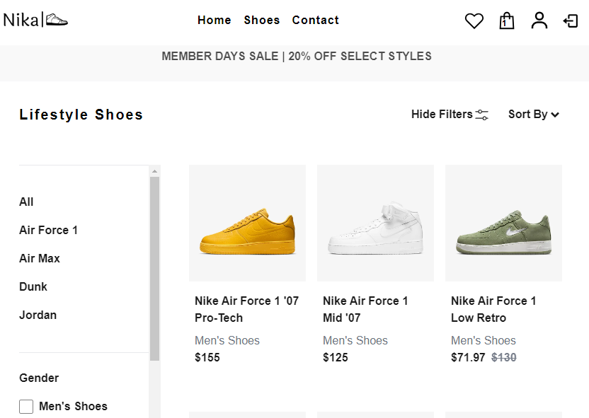

# Nika

## Demo
[Nika website demo](https://tomaszgrobelski.github.io/nika/)

## About the Project

- The login, registration, and access process is based on Firebase authentication mechanisms. Users can create accounts, log in, and access specific features and resources on the site using Firebase authentication mechanisms. This is facilitated through the ProtectedRoute modules, which enable secure and efficient handling of authentication processes.

- On the ShoePage website, the user can filter shoes according to their preferences. After clicking on the product, the user is taken to a page with product details and the option to add the product to the shopping cart. Additionally, the user can add a particular shoe to the favorites card.

- On the checkoutPage, the user sees a summary of the entire order, must decide on the delivery method and then complete the data to send the product. The entire payment is made via the Stripe website, which simulates the process of real payment for the product.

- On the userPage website, the user can add their photo, which is saved in fairbase storage and each time they log in to their account they still have their photo. Each user can only have one unique photo. The photo has been limited to .jpg format. 

## Technologies

The project has been implemented using the following technologies:

- TypeScript
- React
- Tailwind CSS

## Installation

To install and run this project locally, follow these steps:

1. Clone the repository: git clone https://github.com/TomaszGrobelski/nika.git
2. Navigate to the project directory: cd nika
3. Install dependencies: npm install
4. Run the application: npm run dev

## Author

- Tomasz Grobelski - [GitHub]([link_do_profilu](https://github.com/TomaszGrobelski))
